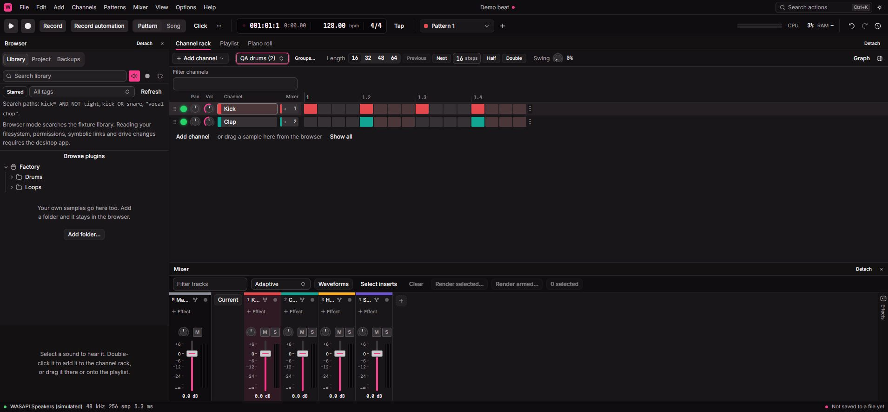
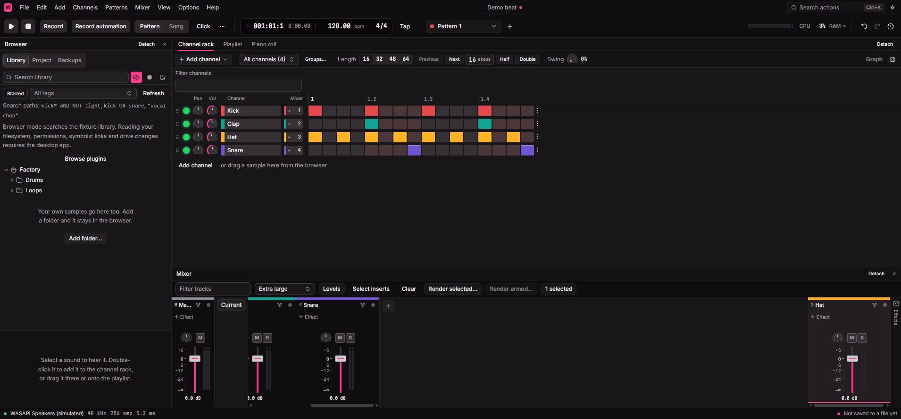
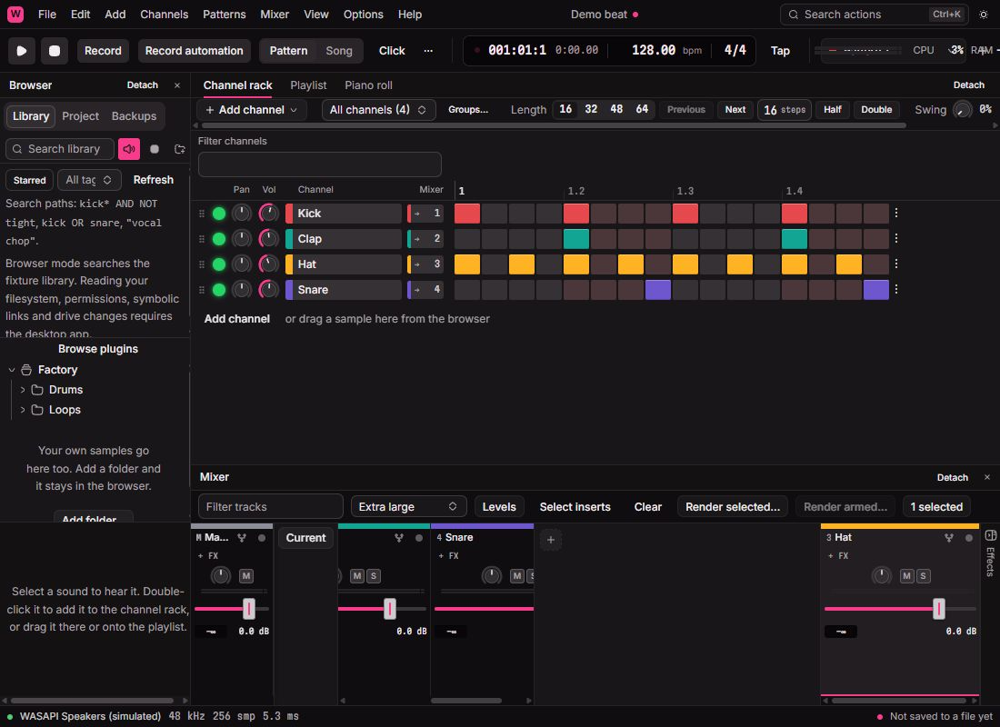
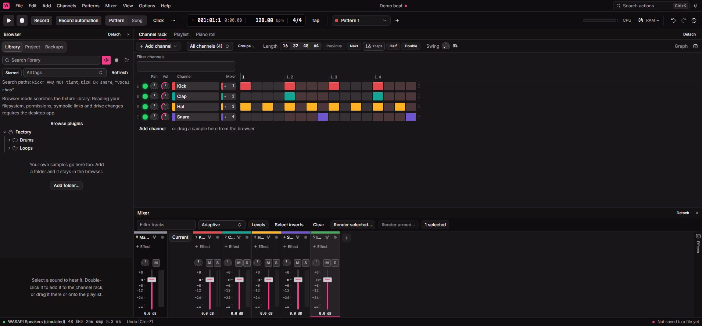

# Live browser smoke check — 2026-10-09

Ran the Vite app at `http://127.0.0.1:1420` in an agent-created Brave tab.
The collaborative preview's snapshot and evaluate operations timed out after
15 seconds; the available browser extension provided the fallback. This checks
the browser simulation with current shared WASM, not physical native audio.

Accepted live interactions:

- Levels/Waveforms switches the displayed meters and announces that native
  audio waveform data requires the desktop app.
- The group manager assigns Kick and Clap to a new `QA drums` group in one
  history step, filters to those two channels, and preserves their step rows.
- Undo removes the assignment and restores all four visible channels; redo
  restores the named group. Keyboard opening and selecting the group filter
  shows the correct members and readable `QA drums (2)` label.
- The piano tab mounts Draw, Paint, Select, Erase, Mute, Slice, Zoom and Playback
  controls, Drum Paint, articulation/color controls and editable ghosts without
  browser errors.
- Captured browser error logs remained empty. This is smoke evidence, not a
  claim of exhaustive gesture, persistence or audio acceptance; see the focused
  automated reports for those checks.

The smoke check exposed raw internal group values (`all:`, `ungrouped:`,
`new:` and `group:QA drums`) on selection triggers. The workflow owner repaired
the caller's labels and added mounted regression assertions. The live app then
showed `All channels (4)` and `QA drums (2)` as expected.

After capturing evidence, the test group was undone, all channels were visible,
and Levels was restored. No project file was saved by this smoke check.

## Final mixer docking and resize acceptance

Repeated against the repaired MIDI simulator, SHA-256
`b379d6bc82d6b3d9882adbcc4b543f3393a09722623ea8cd12c3599e961aaa1c`.
Extra large layout with Kick/Clap/Snare docked left and Hat docked right
exercised actual browser scrolling and measured geometry. At the normal
viewport the left dock was 278px wide with 528px content and a 10px scrollbar;
the middle dock had no scrollbar. Master and every track volume control had
the same top (735.078125px) and bottom (834px). At 1100×800, they all changed
to top 655.90625px and bottom 683.90625px together. The left dock still
overflowed while the middle did not. This accepts the live alignment and
resize boundary in addition to the independently measured mounted fixtures.

The first attempt exposed a development hot-reload action-registration
collision. The workflow owner added old-module action/subscription disposal
and a StrictMode boot-holder, docking and remount regression. After reload,
both docking actions, selection changes, resize and undo succeeded without
the mixer error boundary. Historical console errors are retained as failure
evidence; they are not a claim of a clean first attempt.

The viewport override was reset, both docking edits were undone, selection
was cleared and Adaptive layout restored. No project file was saved.

## Direct hot-reload verification

With the repaired disposal handler installed, a temporary comment triggered
actual Vite replacement of `mixer/actions.ts`. The mixer stayed mounted; the
command palette still contained Add mixer track, and executing it created
Insert 5. Restoring the exact original source bytes triggered a second hot
replacement. The mixer remained healthy and Undo removed Insert 5. The latest
browser error timestamp remained the historical pre-repair error; neither
replacement added an error. A byte comparison verified that the temporary
probe left no source change. Adaptive layout and the four-track demo were
restored.

